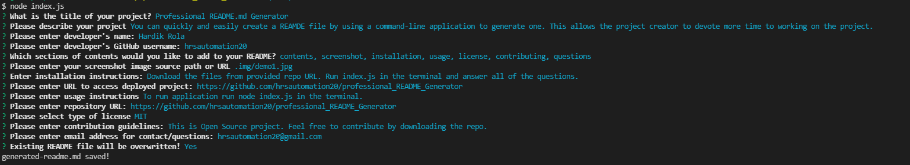

# Professional README.md Generator 

  You can quickly and easily create a README file by using a command-line application to generate one. This allows the project creator to devote more time to working on the project.
  
## Contents

1. [Contents](#contents)
2. [Screenshot](#screenshot)
3. [Installation](#installation)
4. [Usage](#usage)
5. [License](#license)
6. [Contributing](#contributing)
7. [Questions](#questions)

### Screenshot

## Installation

Download the files from provided repo URL to your local computer. 
Application can be accessed at [https://github.com/hrsautomation20/professional_README_Generator](https://github.com/hrsautomation20/professional_README_Generator)

## Usage

To run application on your local computer. Open VSCode and Workspace folder where you have save your repo. Open terminal with in VSCode and run node index.js  
All app code is available at repository [https://github.com/hrsautomation20/professional_README_Generator](https://github.com/hrsautomation20/professional_README_Generator)

[Video_How_to_Use](https://drive.google.com/file/d/1SheVXi0dZQ7K8ZjKUFejI9ZqKoiGj12y/view?usp=sharing)

## License

Licensed under the 

## Contributing

See contribution guidlines below:  
This is Open Source project, Feel free to contribute by downloading the repo.

## Questions

For any questions use contacts below:  
        Developer: Hardik Rola  
        Email: [hrsautomation20@gmail.com](mailto:hrsautomation20@gmail.com)  
        GitHub: [https://github.com/hrsautomation20@gmail.com](https://github.com/hrsautomation20@gmail.com)
  
  *Generated by [readme-generator]*